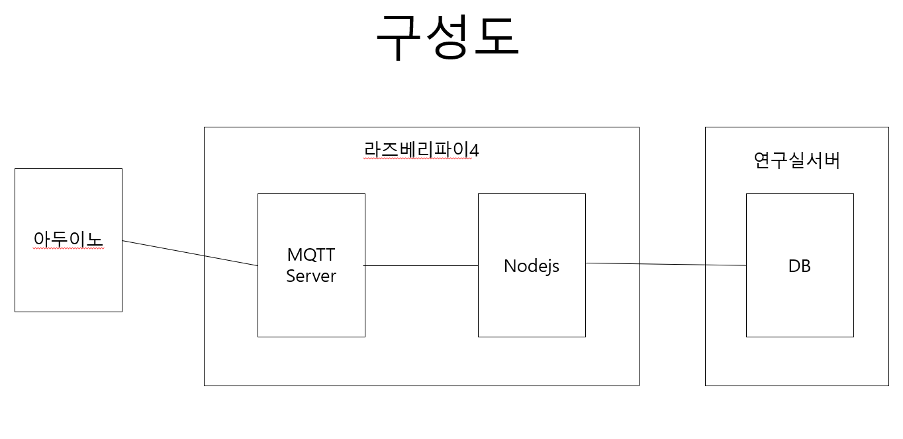

# Development of Time and attendance systems(TNA) using Arduino

아두이노 읽은 카드id를 JSON형식으로 MQTT서버로 전달하면 라즈베리파이안에 있는 nodejs가 MQTT서버에 있는 cardid값을 읽어들여서 연구실 서버에 있는 DB에 저장하는 구성입니다.

  * 아두이노 사용 라이브러리 
   보드매니저 URL : https://github.com/esp8266/arduino 
   심플타이머 : https://github.com/schinken/SimpleTimer

  * 질의 및 문의  
  김희찬 [train1312@naver.com] 
  안 나 [dksek3050@naver.com]